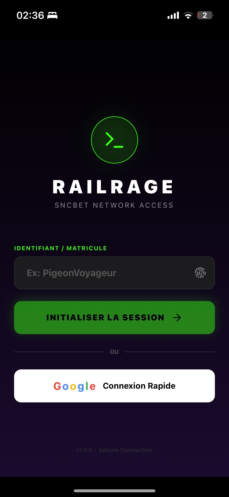
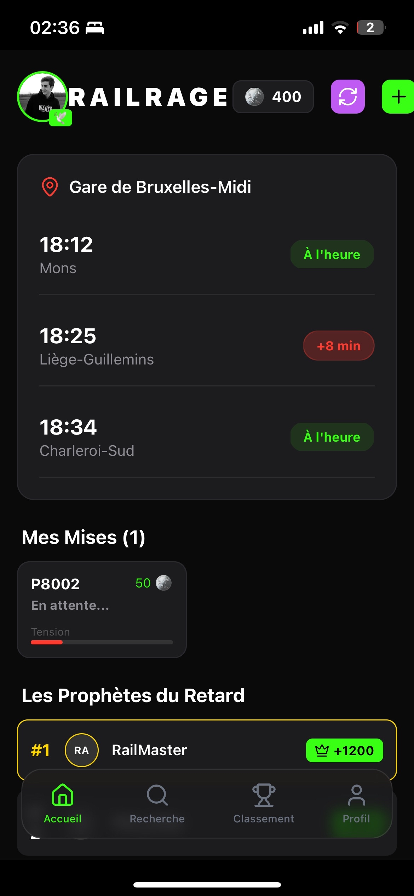
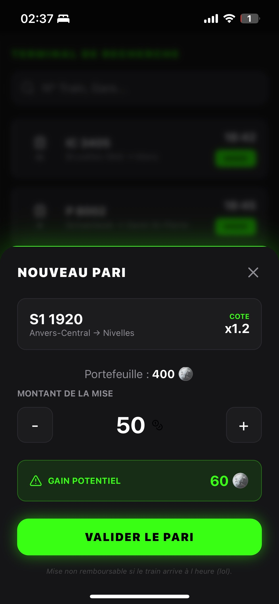
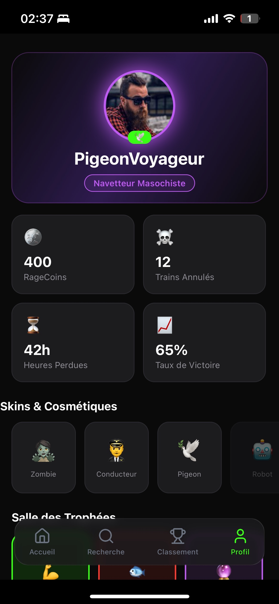

# 🚆 RAILRAGE (SNCBet)

> **"Pariez sur le retard. Devenez riche (virtuellement)."**


**RailRage** est une application mobile conceptuelle qui gamifie la frustration des navetteurs. Au lieu de subir les retards de trains, pourquoi ne pas miser dessus ? Une interface sombre, immersive et agressive pour les prophètes du retard.

---

## 📱 Aperçu du Projet

| Login (Gateway) | Accueil (Dashboard) | Pari (Terminal) | Profil (User) |
|:---:|:---:|:---:|:---:|
|  |  |  |  |


---

## ⚡ Fonctionnalités

### 🎮 Gameplay
* **Système de Paris :** Misez vos "RageCoins" sur des trains en circulation.
* **Moteur de Chaos :** Simulation aléatoire des retards (basé sur un algorithme RNG... ou la réalité belge ?).
* **Récompenses & Punitions :**
    * **Victoire :** Animation de confettis (Lottie) + Gain de coins + Haptics (vibrations).
    * **Défaite :** Animation "Crying Smiley" + Perte de mise + Alerte humiliante.

### 🎨 UI/UX (Design System)
* **Dark Mode Intégral :** Fond `#0A0A0A` pour économiser la batterie en attendant le train.
* **Neon Accents :** Codes couleurs stricts (Vert Acide pour les gains, Rouge Néon pour les retards).
* **Glassmorphism :** Barre de navigation flottante avec effet de flou (`expo-blur`).
* **Animations Fluides :** Transitions d'écrans natives et éléments qui "pulsent" en cas d'alerte.

### 👤 Social & Progression
* **Leaderboard :** Classement des meilleurs parieurs avec podium stylisé.
* **Profil Matricule :** Carte d'identité virtuelle avec statistiques de guerre (Heures perdues, Taux de victoire).
* **Fake Auth :** Écran de connexion immersif type "Terminal d'accès".

---

## 🛠 Stack Technique

Ce projet a été construit avec :

* **Core :** [React Native](https://reactnative.dev/) via [Expo SDK](https://expo.dev/).
* **Navigation :** React Navigation (Native Stack + Bottom Tabs).
* **Animations :**
    * `lottie-react-native` (Effets vectoriels complexes).
    * `react-native-reanimated` & `Animated API` (Transitions UI).
* **UI Components :**
    * `expo-linear-gradient` (Fonds complexes).
    * `expo-blur` (Effets de verre).
    * `lucide-react-native` (Icônes modernes).
* **Feedback :** `expo-haptics` (Retours tactiles).

---

## 🚀 Installation & Lancement

Pré-requis : Avoir `Node.js` installé.

1.  **Cloner le repo :**
    ```bash
    git clone [https://github.com/TON_USER/RailRage.git](https://github.com/TON_USER/RailRage.git)
    cd RailRage
    ```

2.  **Installer les dépendances :**
    ```bash
    npm install
    ```

3.  **Lancer le serveur de développement :**
    ```bash
    npx expo start
    ```
    *Si tu as des soucis de connexion réseau, utilise le mode tunnel :*
    ```bash
    npx expo start --tunnel
    ```

4.  **Scanner le QR Code :** Utilise l'application **Expo Go** (iOS/Android) pour voir l'appli sur ton téléphone.

---

## 🔮 Roadmap (Idées futures)

* [ ] **Persistance des données :** Sauvegarder le solde avec `AsyncStorage`.
* [ ] **Shop :** Acheter des skins d'avatar avec les RageCoins.
* [ ] **API iRail :** Connecter les vraies données temps réel de la SNCB.
* [ ] **Mode Multijoueur :** Créer des syndicats de parieurs.

---

## 📄 Licence

Distribué sous la licence MIT. Fait avec rage en Belgique 🇧🇪.
